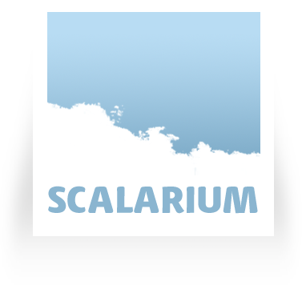
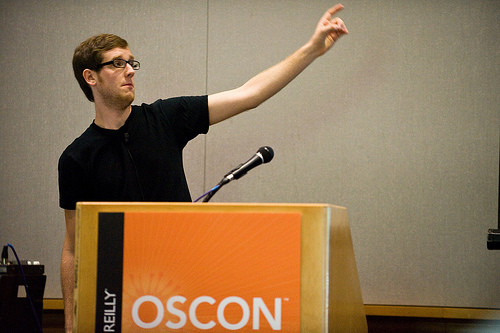
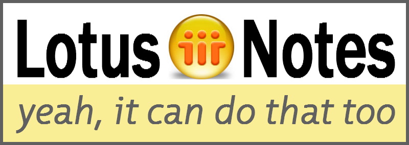

!SLIDE center

## Building Web Applications with your Browser and CouchDB ##

!SLIDE

## A practical introduction to the philosophies behind CouchDB ##

!SLIDE bullets incremental

# $(this) #

* Mathias Meyer
* Chief Visionary at [Peritor, Berlin](http://peritor.com)
* [@roidrage](http://twitter.com/roidrage)
* <http://paperplanes.de>
* CouchDB User

!SLIDE

# I like automating things. #

  Me, 2003 - Open End

!SLIDE center

## [Cloud-Management and -Deployment for Ruby, PHP and Java](http://scalarium.com) ##

!SLIDE center

!SLIDE

# What is CouchDB? #

!SLIDE center

!SLIDE bullets incremental

# What is CouchDB? #

* A database
* A web server
* An application server

!SLIDE bullets incremental

# But what is it really? #

* A Document Database
* Heavily inspired by Lotus Notes

!SLIDE center

!SLIDE center

# What is a Document? #

!SLIDE bullets incremental

* A user
* An email
* A text document
* A calendar entry
* A tweet

!SLIDE bullets incremental

## A self-contained, ##
## semi-structured piece of data. ##

* Metadata included
