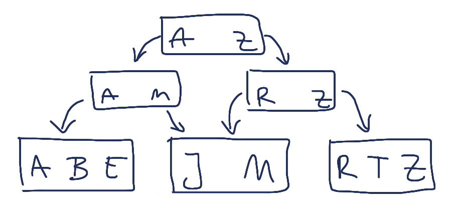

!SLIDE

## "CouchDB is just a B-Tree and a Transformation Engine." ##

<a href="http://twitter.com/bitdiddle/status/19645939355">Anonymous Tweeter</a>

!SLIDE center

# The B-Tree #

!SLIDE

## All data is stored in a B-tree. ##

!SLIDE

## Data is always appended, ##
## never updated. ##

!SLIDE

# Querying Data #

!SLIDE bullets incremental

* Custom Queries are stored as Views
* Views are written in JavaScript
* Views are part of design documents

!SLIDE bullets incremental

# Views #

* Keys pointing to a value
* Keys can be any valid JSON object
* Values can be documents
* Custom objects too

!SLIDE bullets incremental

# Map/Reduce #

* Map emits the desired lookup keys
* Reduce aggregates the results

!SLIDE javascript

# Map Phase #

## Find by Name ##

    @@@ javascript
    function(doc) {
      emit(doc.name, null);
    }

!SLIDE javascript

## Find by tag ##

    @@@ javascript
    function(doc) {
      for (var index in doc.tags) {
        emit(doc.tags[index], 1);
      }
    }

!SLIDE javascript small

## Find by tag ##

    @@@ javascript
    function(keys, values, rereduce) {
      var sum = 0;
      for (var i = 0; i < values.length; i++) {
         sum += values[i];
      }
      return sum;
    }

!SLIDE smaller

## Querying Views ##

    /jaoo/_design/conferences/_view/by_name?key="JAOO 2010"

!SLIDE bullets incremental

# Design Documents #

* Collect map/reduce functions
* Name convention: `_design/<document>`
* Regular JSON document

!SLIDE javascript small

# Design Documents #

    @@@ javascript
    {
      "_id": "_design/conferences"
      "views": {
        "by_name": {
          "map": "function(doc)...",
          "reduce": "function(keys, values, rereduce)"
        }
      }
    }

!SLIDE bullets incremental

# Views #

* Are only updated on read
* Are always read from disk
* Can fetch ranges too
