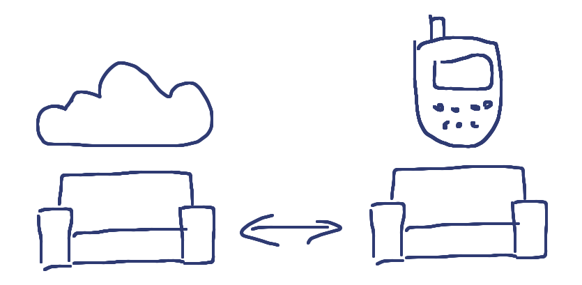

!SLIDE

## ”Localhost is local most.“ ##

Mario Scheliga

!SLIDE center

## Offline by default. ##

!SLIDE bullets incremental

## Runs on ##

* Your laptop
* Your mobile
* Your server
* The Cloud™

!SLIDE center

## Syncs ##
## between all of them! ##

!SLIDE bullets incremental

# P2P-like Replication #

* Replicate any database
* To and from any database
* At any point in time

!SLIDE bullets incremental

## Even filter data before replicating. ##
